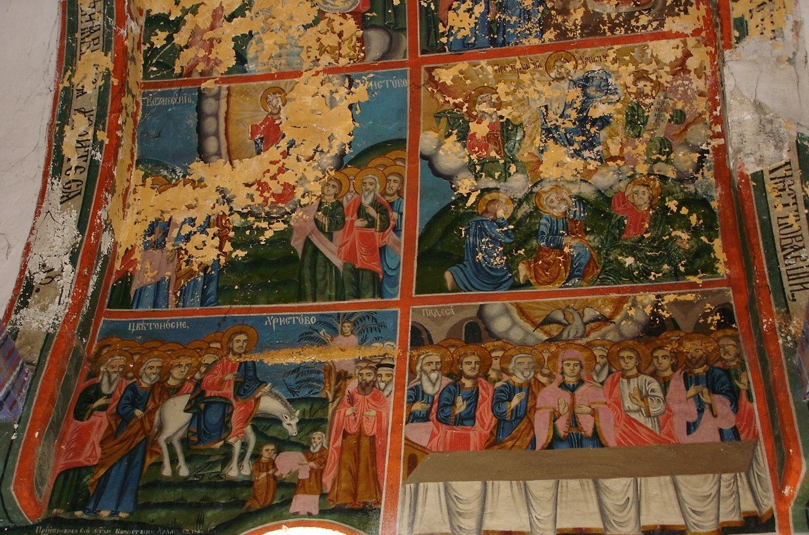
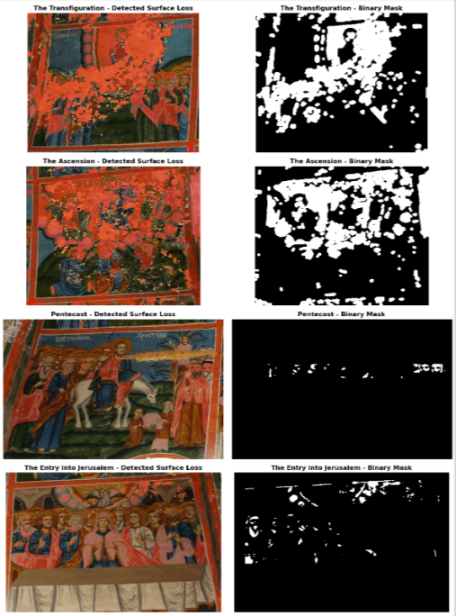

# Recovering the Unrecoverable — Yamborano Fresco Damage Mapping Notebook

**A computational research companion to the article _Recovering the Unrecoverable: Documenting and Interpreting a Vanishing Bulgarian National Revival Fresco Cycle_.**

This repository contains the computational notebook and selected research outputs supporting the computer-vision analysis of visible surface loss in the Yamborano fresco cycle.

---

## 📁 Repository Structure

```text
.
├── data/
│   └── yamborano_fresco.jpg
├── outputs/
│   ├── per_scene_masks.png
│   └── yamborano_surface_loss_quantification.csv
├── Recovering_the_Unrecoverable_Yamborano_Fresco_Damage_Mapping_Notebook.ipynb
├── requirements.txt
├── LICENSE
├── CITATION.cff
└── README.md
```

| File / Directory | Description |
|---|---|
| 📂 `data/` | Source photographic material used in the analysis |
| 📂 `outputs/` | Selected visual and quantitative outputs |
| 📓 `Recovering_the_Unrecoverable_Yamborano_Fresco_Damage_Mapping_Notebook.ipynb` | Complete computational research notebook |
| 📦 `requirements.txt` | Python dependencies required by the notebook |
| 📄 `LICENSE` | MIT License |
| 📄 `CITATION.cff` | Citation metadata for the research software |
| 📄 `README.md` | Repository documentation |

---

## 🖼️ From Source Image to Computational Segmentation

### Source Photograph



### Scene-Specific Segmentation



---

## 🏛️ Research Context

The notebook accompanies the study of a damaged Bulgarian National Revival fresco cycle in the **Church of the Dormition of the Mother of God, Yamborano, Kyustendil province, Bulgaria**.

The analysis is based on a photographic record made by the author in **2005** and addresses the problem of quantifying visible surface loss in four surviving photographic compartments of the mural cycle.

The computational workflow was developed to move beyond an impressionistic assessment that “much of the cycle is lost” and to provide a transparent quantitative description of the surface loss visible in the available photographic record.

---

## 🔬 Computational Method

The notebook implements a classical computer-vision workflow for the detection and quantification of exposed underlying plaster associated with paint loss.

The final workflow includes:

- **image preparation**
- **scene-specific cropping**
- **colour-based segmentation**
- **morphological processing**
- **binary mask generation**
- **visual verification**
- **scene-level surface-loss calculation**
- **graphical visualization of the results**

A central methodological difficulty is the **spectral overlap** between exposed plaster and preserved light-coloured pictorial elements, including white garments, halos, facial highlights, and other illuminated passages.

The experiments documented in the notebook show that no single fully automatic segmentation technique produced satisfactory results across all four scenes. The final approach therefore uses **scene-specific segmentation**, with thresholds and spatial constraints adjusted according to the visual and chromatic characteristics of each composition.

The notebook also documents the alternative computer-vision approaches tested during the methodological development of the workflow and the reasons why they proved unsuitable for the present case.

---

## 📊 Quantitative Results

| Scene | Detected surface loss |
|---|---:|
| **The Transfiguration** | **31.21%** |
| **The Ascension** | **32.43%** |
| **Pentecost** | **0.75%** |
| **The Entry into Jerusalem** | **2.60%** |
| **Overall detected surface loss** | **16.66%** |

These values represent **detected surface loss within the analysed photographic regions** and should not be interpreted as conservation-grade measurements of the physical condition of the murals.

Visual inspection of the generated masks indicates that some visually identifiable areas of surface loss remain undetected. This is particularly apparent where exposed plaster has visual characteristics similar to preserved pictorial elements.

The reported percentages should therefore be understood as **conservative computational estimates of the surface loss detected by the implemented procedure**.

---

## ⚠️ Methodological Limitations

The computational segmentation does not constitute an exhaustive reconstruction of all physically lost paint.

The principal limitation is the difficulty of distinguishing exposed plaster from preserved light-coloured pictorial passages using image characteristics alone. This can produce both false-positive and false-negative segmentation results.

The quantitative analysis should consequently be interpreted in relation to the photographic evidence available for this study.

The source photograph records the condition of the mural in **2005** and may itself already represent a stage of deterioration. Subsequent changes to the monument are outside the scope of the present analysis.

---

## 📦 Requirements

The notebook is designed to run in a Python environment with the packages listed in `requirements.txt`.

The computational environment is based exclusively on open-source Python libraries used for scientific computing, image processing, data analysis, and visualization.

The `requirements.txt` file records the software dependencies required to reproduce the computational workflow and contributes to the reproducibility of the research.

---

## 🔁 Reproducibility

The notebook records the computational procedures, scene-specific segmentation decisions, quantitative calculations, and visual outputs underlying the reported results.

The purpose of the workflow is **transparent and reproducible quantitative documentation of the photographic record**, rather than automated reconstruction of the missing imagery or replacement of direct material examination.

---

## 🎨 Relation to Art-Historical Research

The computational notebook is intended as a **research companion** to the accompanying art-historical study.

Computer vision is used as an analytical instrument within traditional art-historical research. It provides quantitative information about visible surface loss while leaving the identification, interpretation, iconographic analysis, and historical contextualization of the mural cycle to the art-historical investigation.

The project demonstrates how computational methods can complement traditional art-historical approaches to the documentation and study of endangered cultural heritage.

---

## 📚 Citation

If you use this notebook, its methodology, code, or quantitative results in your research, please cite the archived version of this repository.

Citation metadata are provided in `CITATION.cff`.

---

## 👤 Author

**Desislava S. Georgieva, PhD in Art History**

Independent Researcher in Art History and Digital Art History.

---

## 📷 Image and Documentation

The source photograph analysed in this repository was taken by the author in **2005** in the Church of the Dormition of the Mother of God, Yamborano, Kyustendil province, Bulgaria.

Permission to photograph the church interior was granted by the local representatives of the **Bulgarian Orthodox Church**.

---

## 📄 License

This repository is released under the **MIT License**.

See [`LICENSE`](LICENSE) for the full license text.
